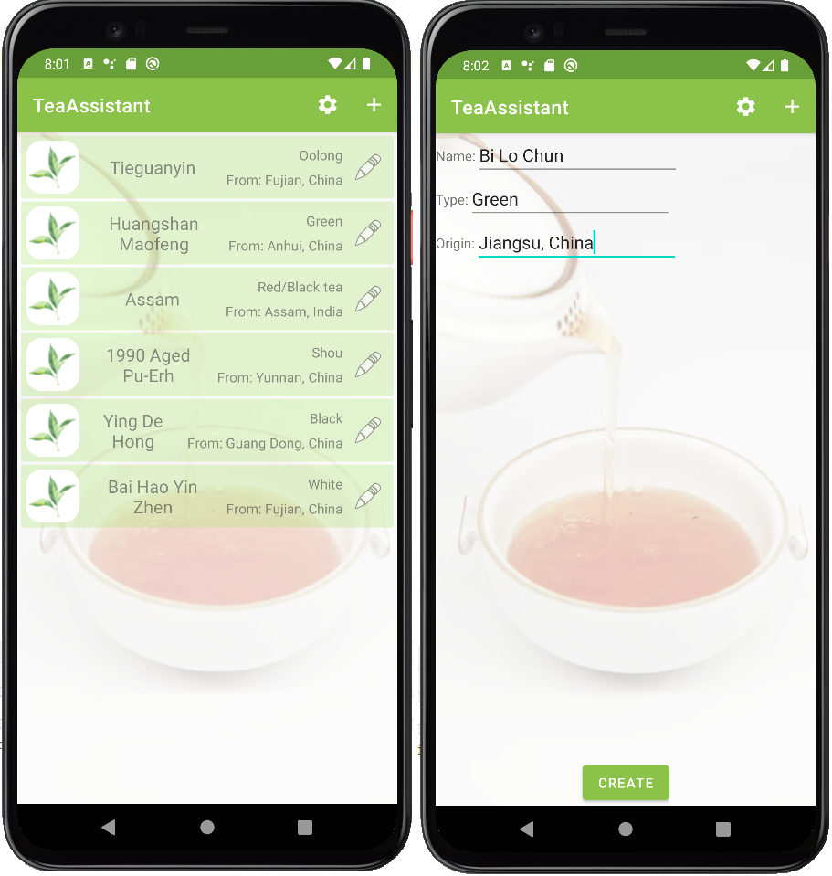

# TeaAssistant
Application for recording information about teas

## Note!
This application is under development. The master branch contains minimum viable product. (upd: 26.03.23)
I plan to add more features in the future.

## Implementation details
* Multiple module architecture (app (presentation + di), domain, data)
* Kotlin
* Android Architecture Components
* Room
* Shared Preferences
* Hilt / Dagger2

## Screenshots
### Screens
